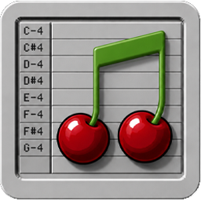

<h1 tabindex="-1" class="heading-element" dir="auto">
  
  CherryTracker
</h1>

A playback-only Amiga-style module player written in **Red/View**, using
**[libxmp](https://github.com/libxmp/libxmp)** to decode modules and
**[SDL3](https://libsdl.org)** for audio output. The whole gray-bevel,
[FlodPro](https://photonstorm.com/flod-archived-2)-inspired UI is drawn with
the Red **Draw** dialect in a resizable window.

<p align="center">
  
  
</p>

## Features

- Plays **MOD / XM / S3M / IT / …** — every format libxmp supports, up to 64 channels.

- **Spectrum analyzer** — a real frequency display: 48 log-spaced Goertzel
  bands (55 Hz–12 kHz) over the Hann-windowed output PCM, colour-by-height
  bars with slow-falling peak caps.

- **Per-channel VU meters** — smooth gradient bars with fast-attack/slow-decay ballistics and palette-style side bezels. Classic soundtracker look.

- **Scrolling pattern grid** — row gutter, blue PT-style
  note/instrument/effect columns, highlighted current row.

- **Full transport** — play / pause / stop / loop, position spinners, **seek slider**, master volume.

- **Song info** — name, file + size, tracker type, channels, patterns,
  instruments, samples, tempo, speed, elapsed / remaining / total time.

- **Sample-accurate audio↔visual sync** — a snapshot FIFO keyed on
  bytes-played surfaces exactly the frame that is audible right now, so the
  meters and pattern never lead the sound even with audio buffered ahead.

- **Resizable & maximizable** — drag any edge or maximize; the all-vector UI
  keeps its 4:3 aspect, scaling crisply and centering with matching gray
  margins (no stretching, no blur).

## Run

```
CherryTracker.exe                   # opens; click LOAD to choose a module
CherryTracker.exe path\to\song.mod  # auto-load and play (also works as "open with")
```

The shipped `CherryTracker.exe` is the **static release build — fully
self-contained**, no DLLs needed. A handful of classic modules is included
in `mods/`.

## Build

[Download](https://www.red-lang.org/p/download.html) the latest toolchain binary ("Automates builds" section), rename it to `redc` and drop it in the repo.

Windows:
```
redc -r -s -t Windows -o CherryTracker.exe player.red
```
Linux:
```
./redc -r -s -t Linux-GTK -o CherryTracker player.red
```
For Linux, ensure that you have the 32-bit dependencies installed (see the bottom of the Download page). Also if running it from WSL, add the pulseaudio 32-bit lib:
```
sudo apt install pulseaudio:i386
```

Prebuilt statically linked binaries for Windows and Linux available in `builds/`.

x86 dependencies for compilation (prebuilt versions available in `libs/`):

- **libxmp** — [upstream](https://github.com/libxmp/libxmp) 
- **SDL3** — [upstream](https://github.com/libsdl-org/SDL)

## Layout

| file              | role |
|-------------------|------|
| `player.red`      | the app — FFI bindings, `routine!` bridges, snapshot-FIFO sync, the Draw renderer + View loop |
| `xmp.reds`        | Red/System binding for libxmp (offset-based `xmp_frame_info` / `xmp_module` accessors) |
| `audio.reds`      | slim SDL3 audio-stream output (manual-feed, S16 / 2ch / 44100) |
| `cherry.ico`      | application icon (embedded via the Red `Icon:` header field) |

## Credits

- **libxmp** © Claudio Matsuoka & Hipolito Carraro Jr — MIT license.
- **SDL3** — zlib license.
- UI layout inspired by **FlodPro** (Christian Corti's Flod replay core,
  ProTracker interface published by Photon Storm).
- Test modules courtesy of [The Mod Archive](https://modarchive.org).

---

Made with ❤️ with [Red](https://github.com/red/red) and Claude Code.